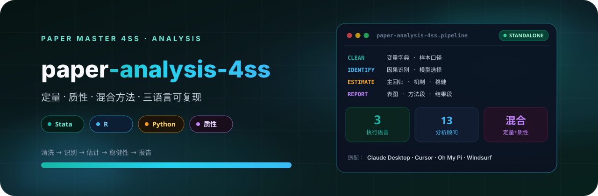

<p align="center">
  
</p>

# Paper 数据分析 4SS

中文社会科学论文数据分析技能。用于结构化数据清洗、描述统计、主回归、中介/机制、调节、异质性、门槛、非线性、政策识别、稳健性检验、质性材料编码、主题/内容分析、混合方法整合和论文结果呈现。支持 Stata、R、Python，内置常用社科基础模型、三语言模板和案例。当用户需要从数据或访谈/文本材料产出论文级表格、图形、代码、方法说明和结果段落时使用。

## 4SS 家族

| 包 | 职责 |
|---|---|
| [paper-master-4ss](https://github.com/JingYangYuan/paper-master-4ss) | 总控：登记输入、选择模块、维护工作区 |
| [paper-design-4ss](https://github.com/JingYangYuan/paper-design-4ss) | 选题、框架路由、研究设计蓝图 |
| [paper-lit-4ss](https://github.com/JingYangYuan/paper-lit-4ss) | 中英文检索、文献地图、空白与假设 |
| [paper-outline-4ss](https://github.com/JingYangYuan/paper-outline-4ss) | 素材转大纲、证据映射、缺口报告 |
| **[paper-analysis-4ss](https://github.com/JingYangYuan/paper-analysis-4ss)**（本仓库） | 定量 / 质性 / 混合，Stata · R · Python |
| [paper-write-4ss](https://github.com/JingYangYuan/paper-write-4ss) | 章节写作、润色、语言扫描、正文净稿 |
| [paper-submission-4ss](https://github.com/JingYangYuan/paper-submission-4ss) | Word 导出、体例、投稿清单与信函 |
| [paper-update-4ss](https://github.com/JingYangYuan/paper-update-4ss) | 待审核更新包，不直接改核心文件 |

## 它做什么

把结构化数据、面板、访谈/田野/开放题文本和政策档案转成可复现的清洗脚本、估计结果、质性编码和论文结果素材。内置 Stata、R、Python 三语言模板。

不替代 design 的识别策略裁决；结果声称边界交给 write。Stata MCP / 本地 Stata 按 `references/install-dependencies.md` 验收。

## 安装

将本目录放到宿主的 skill 目录。入口见 `SKILL.md`。

```bash
git clone https://github.com/JingYangYuan/paper-analysis-4ss.git
```

与 [`paper-master-4ss`](https://github.com/JingYangYuan/paper-master-4ss) 同级安装时，跨模块路径才能解析。只做本模块任务也可以单独使用。

## 与总控的关系

本包由总控 [`paper-master-4ss`](https://github.com/JingYangYuan/paper-master-4ss) 导出；对应源目录是总控包内的 `modules/analysis/`：

- 包内相对路径相对本包根目录解析
- `master/` 与部分 `references/` 是导出时的协议快照
- 更新方式：修改总控对应模块后重新导出，不要直接改本仓库

## License

[MIT](LICENSE)
